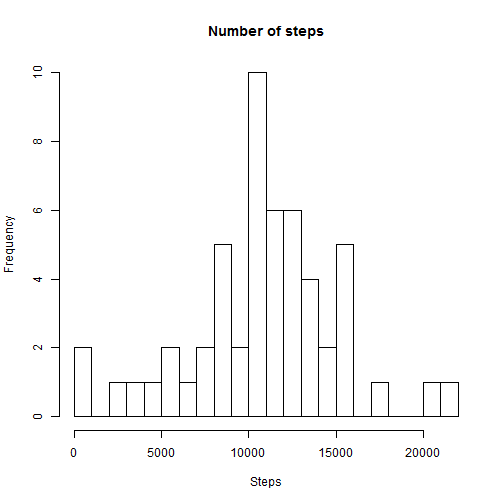
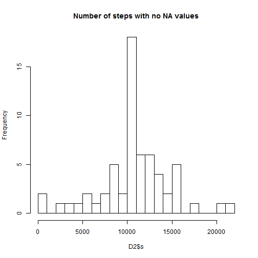

##Loading and preprocessing the data

```r
setwd("C:/Users/Carlo/Desktop/PCCarlo/Carlo/Coursera/DataScientistToolBox/Reproducible Research/Ass.1/repdata-data-activity")
Data<-read.csv("activity.csv",header=TRUE,na.strings = "NA",sep=",");
```
##What is mean total number of steps taken per day?
###Calculate the total number of steps taken per day

```r
library(dplyr);
```

```
## Warning: package 'dplyr' was built under R version 3.2.1
```

```
## 
## Attaching package: 'dplyr'
## 
## The following objects are masked from 'package:stats':
## 
##     filter, lag
## 
## The following objects are masked from 'package:base':
## 
##     intersect, setdiff, setequal, union
```

```r
#Numero di steps per ogni giorno
by_date<-group_by(Data,date);
NDays<-summarize(by_date,sum(steps));
D<-as.data.frame(NDays);
Steps<-D[,2];
```
The total number of steps taken per day is: NA, 126, 11352, 12116, 13294, 15420, 11015, NA, 12811, 9900, 10304, 17382, 12426, 15098, 10139, 15084, 13452, 10056, 11829, 10395, 8821, 13460, 8918, 8355, 2492, 6778, 10119, 11458, 5018, 9819, 15414, NA, 10600, 10571, NA, 10439, 8334, 12883, 3219, NA, NA, 12608, 10765, 7336, NA, 41, 5441, 14339, 15110, 8841, 4472, 12787, 20427, 21194, 14478, 11834, 11162, 13646, 10183, 7047, NA

##Histogram, mean and median:

```r
me<-mean(Steps,na.rm=TRUE);
med<-median(Steps,na.rm=TRUE);
```
The mean and median number of steps taken each day is respectively: 1.0766189 &times; 10<sup>4</sup> and 10765.
The histogram of the number of steps each day is:

```r
hist(Steps,breaks=20, main="Number of steps") #Number of steps histogram
```

 

##What is the average daily activity pattern?


```r
by_interval=group_by(Data,interval);
Av_steps<-summarize(by_interval,mean(steps, na.rm="TRUE"));
plot(Av_steps$interval,Av_steps$mean,type="l",xlab="Interval",ylab="#Steps")
```

 
The 5-min interval that contains,on average, the maximum number of steps is:

```r
which(Av_steps[,2]==max(Av_steps[,2]))
```

```
## [1] 104
```

##Imputing missing values
The total number of missing values in the dataset is

```r
a<-apply(Data,2,is.na)
a<-apply(a,2,sum)
Num_steps<-a[[1]] #Total number of NA values in the DataSet
```
The total number of NA values is: 2304


```r
D2<-Data %>% #create a copy of original Data and substitutes NA with mean of that 5-min interval
  group_by(interval) %>%
  mutate(m=mean(steps,na.rm=TRUE)) %>%
  mutate(steps=ifelse(is.na(steps),m,steps)) %>% #Sostituisco medie NA e metto 0
  select(-m)
D3<-D2
#Now calculate hist
D2<-D2 %>%  
  group_by(date) %>%
  summarize(s=sum(steps)) %>%  
  as.data.frame()
hist(D2$s, breaks=20,main="Number of steps with no NA values")
```

 

```r
me<-mean(D2$s);
med<-median(D2$s);
```
The mean and median of the number of steps of the dataset in which NA are substituted by the mean of that 5 min interval are respectively 1.0766189 &times; 10<sup>4</sup> and1.0766189 &times; 10<sup>4</sup>.

##Are there differences in activity patterns between weekdays and weekends?
Now, first of all I install lubridate and ggplot2 packages

```r
#Days
library(lubridate)
```

```
## Warning: package 'lubridate' was built under R version 3.2.1
```

```r
library(ggplot2)
```

```
## Find out what's changed in ggplot2 with
## news(Version == "1.0.1", package = "ggplot2")
```

```r
#1 Creation of factor variable Days
Days<-factor(wday(D3$date),levels=1:7) #Wday mi da il numero del giorno da 1 a 7
levels(Days)<-list('Wd'=1:5, 'We'=c(6,7))
#2 Recognize and filter out WeekDays and WeekEnds
D4 <- data.frame(D3,Day = Days)
D_Wd<-filter(D4,Day=="Wd")
D_We<-filter(D4,Day=="We")

#Using group_by and mutate by dplyr package to calculate the number of steps based on interval values
D_Wd<-D_Wd %>%
  group_by(interval) %>%
  mutate(NSteps=sum(steps))
#Using group_by and mutate by dplyr package to calculate the number of steps based on interval values
D_We<-D_We %>%
  group_by(interval) %>%
  mutate(NSteps=sum(steps))
```

Next the plot (using ggplot2) of the number of the mean number of steps in WeekEnd in each 5 minute interval


```r
#Plot the mean value of WeekDays and WeekEnds number of steps in each 5 minute interval 
p_We<-ggplot()+geom_line(data=D_We,aes(x=interval,y=NSteps),
                         color='steelblue') +
xlab("Interval")+
ylab("Number of steps")
print(p_We)
```

 

Next the plot (using ggplot2) of the number of the mean number of steps in WeekDays in each 5 minute interval


```r
p_Wd<-ggplot()+geom_line(data=D_Wd,aes(x=interval,y=NSteps),
                         color='steelblue') +
xlab("Interval")+
ylab("Number of steps")
print(p_Wd)
```

 
Yes they are different! We can observe that the subject walks much more during the WeekDays!
